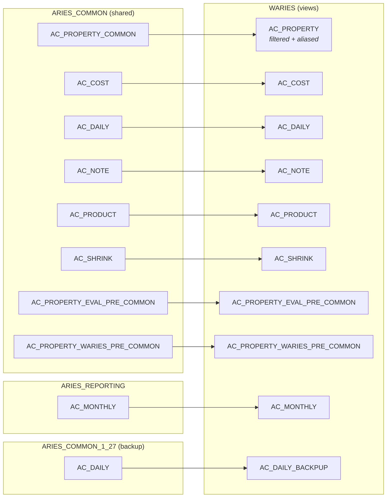
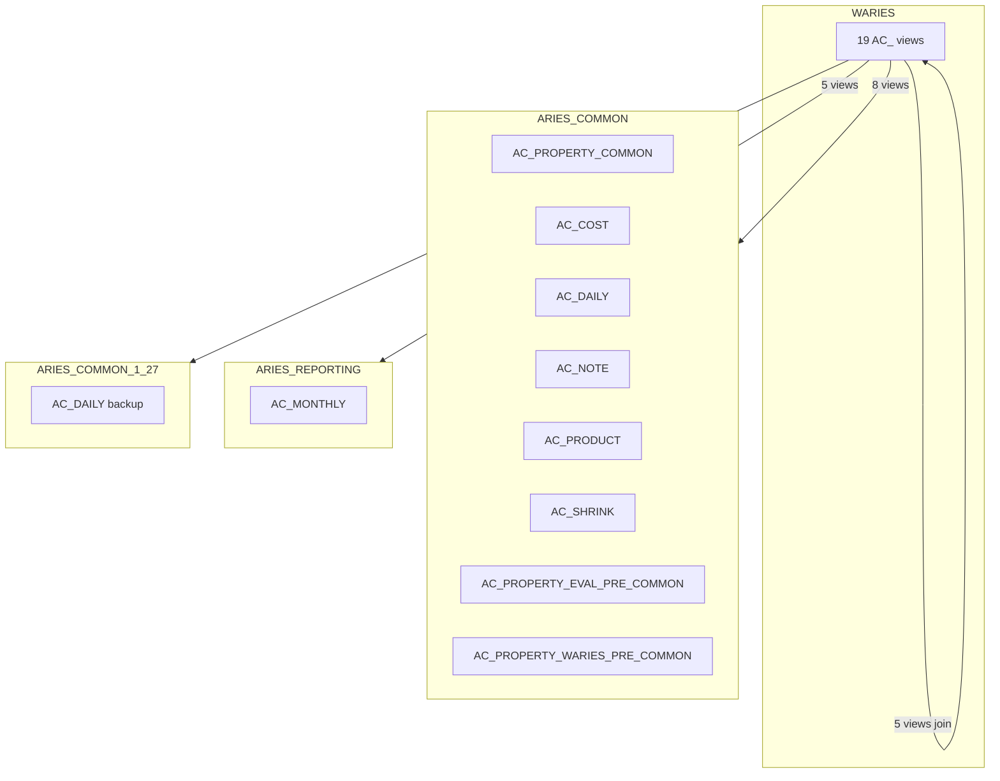
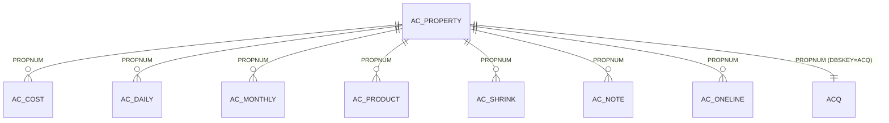

# WARIES AC_ Views Profile

Server: **dbaries** | Database: **WARIES** | Profiled: 2026-03-06

19 views with the `AC_` prefix (plus `ACQ`). They fall into three categories:
pass-through views into shared databases, join/reporting views, and filtered subsets.

---

## Architecture Overview

## Join / Reporting Views

```mermaid
graph TD
    AC_PROPERTY["AC_PROPERTY<br/>(master property view)"]
    AC_ONELINE[AC_ONELINE]
    AC_COST[AC_COST]
    AC_SHRINK[AC_SHRINK]
    AC_PRODUCT[AC_PRODUCT]
    AC_MONTHLY["AC_MONTHLY<br/>(ARIES_REPORTING)"]
    BFIT_LIST_V[BFIT_LIST_V]
    FULL_INTEREST_V[FULL_INTEREST_V]

    AC_PROPERTY --> AC_DAILY_V
    AC_DAILY --> AC_DAILY_V

    AC_PROPERTY --> AC_MONTHLY_AFE_EVAL_V
    AC_MONTHLY --> AC_MONTHLY_AFE_EVAL_V

    AC_PROPERTY --> AC_MONTHLY_MYTIEOUT_V
    AC_MONTHLY --> AC_MONTHLY_MYTIEOUT_V

    AC_PROPERTY --> AC_MONTHLY_V
    AC_MONTHLY --> AC_MONTHLY_V

    AC_PROPERTY --> AC_ONELINE_V
    AC_ONELINE --> AC_ONELINE_V
    BFIT_LIST_V --> AC_ONELINE_V

    AC_PROPERTY --> AC_ONELINE_V_ATHENA
    AC_ONELINE --> AC_ONELINE_V_ATHENA
    FULL_INTEREST_V --> AC_ONELINE_V_ATHENA

    AC_PROPERTY --> AC_PROD_NEW_WELLS_V
    AC_PRODUCT --> AC_PROD_NEW_WELLS_V

    AC_PROPERTY --> AC_PROPERTY_SPOTFIRE_V
    AC_COST --> AC_PROPERTY_SPOTFIRE_V
    AC_SHRINK --> AC_PROPERTY_SPOTFIRE_V
    FULL_INTEREST_V --> AC_PROPERTY_SPOTFIRE_V

    AC_PROPERTY --> ACQ
```

---

## View Catalog

### Category 1: Pass-Through Views

These are direct selects from shared databases with no joins. They expose
cross-database tables as local objects in WARIES.

#### AC_PROPERTY

| Attribute | Value |
|-----------|-------|
| **Source** | `ARIES_COMMON.dbo.AC_PROPERTY_COMMON` |
| **Filter** | `WARIES_WEG_RSV_CAT IS NOT NULL AND WARIES_DBSKEY IS NOT NULL` |
| **Columns** | ~130 |
| **Key** | `PROPNUM` (varchar 12) |

The central property/well master view. Aliases `WARIES_DBSKEY` → `DBSKEY` and
`WARIES_WEG_RSV_CAT` → `WEG_RSV_CAT` so each Aries database sees its own
assignments from the common table.

**Column groups:** Identifiers, Well Info, Classification/Reserve Categories,
Geography/Location, Engineering/Completions, Type Curves/Geology, Dates,
Acquisition, Comments, User Fields.

---

#### AC_COST

| Attribute | Value |
|-----------|-------|
| **Source** | `ARIES_COMMON.dbo.AC_COST` |
| **Filter** | None |
| **Key** | `PROPNUM` |

Operating costs, severance taxes, capital costs (drilling, completion, facilities,
recompletion, abandonment).

**Key columns:** `OPCT`, `OPCOGW`, `OVRHD`, `OPCGAS`, `OPCOIL`, `OPCWTR`, `ATX`,
`SEVGAS/SEVOIL/SEVNGL`, `DRLGTANG/DRLGINTANG`, `COMPTANG/COMPINTANG`, `FACILITY`,
`RECOMPL`, `ABDN`, `FL_TOTAL`, `FL_SINGLE`.

---

#### AC_DAILY

| Attribute | Value |
|-----------|-------|
| **Source** | `ARIES_COMMON.dbo.AC_DAILY` |
| **Filter** | None |
| **Key** | `PROPNUM` + `D_DATE` |

Daily production data: `OIL`, `GAS`, `WATER`, `TBG`, `CSG`, `WELLS`, `NET_WELLS`,
`COMMENTS`, `CHK`, `DOWN`, `DAILY_SOURCE`.

---

#### AC_MONTHLY

| Attribute | Value |
|-----------|-------|
| **Source** | `ARIES_REPORTING.dbo.AC_MONTHLY` |
| **Filter** | None |
| **Key** | `PROPNUM` + `SCENARIO` + `OUTDATE` |

Monthly economic output from Aries runs. Columns are coded (`S338`, `S339`, etc.)
representing gross wells, production, revenue, costs, and cash flow by scenario.

**Column map (from reporting views):**

| Code | Meaning |
|------|---------|
| S338 | Gross Oil Wells |
| S339 | Gross Gas Wells |
| S370 | Gross Oil |
| S371 | Gross Gas |
| S374 | Gross NGL |
| S376 | Gross Water |
| S750 | Capex component 1 |
| S751 | Capex component 2 |
| S753 | WI Oil Sold |
| S754 | WI Gas Sold |
| S815 | Net Oil Sold |
| S816 | Net Gas Sold |
| S819 | Net NGL Sold |
| S846 | Oil Revenue |
| S847 | Gas Revenue |
| S850 | NGL Revenue |
| S861 | Total Revenue |
| S887 | Severance Tax |
| S892 | (see Aries docs) |
| S1062 | OPEX |
| S1064 | Ad Valorem |
| S1065 | Net OPEX + Ad Val |
| S1069 | Operating Cash Flow |

---

#### AC_PRODUCT

| Attribute | Value |
|-----------|-------|
| **Source** | `ARIES_COMMON.dbo.AC_PRODUCT` |
| **Filter** | None |
| **Key** | `PROPNUM` + `P_DATE` |

Monthly production actuals: `OIL`, `GAS`, `WATER`, `IHS_OIL/GAS/WATER`,
`THEORETICAL_OIL/GAS/WATER`, `INCLUDE_OIL/GAS/WATER`, `MONTHLY_SRC`, `NORMMONTH`.

---

#### AC_SHRINK

| Attribute | Value |
|-----------|-------|
| **Source** | `ARIES_COMMON.dbo.AC_SHRINK` |
| **Filter** | None |
| **Key** | `PROPNUM` |

Gas shrinkage/processing parameters: `GASPADJ`, `GASPMUL`, `BTU`, `OILPADJ`,
`OILPMUL/OILPMUL2`, `NGLPMUL`, `NGLPAD`, `IGS`, `FGS`, `YR_FGS`,
`NGLYLD_I/NGLYLD_F`, `YLD_YRS`, `STREAM`, `GOR_6_MO_CUM`.

---

#### AC_NOTE

| Attribute | Value |
|-----------|-------|
| **Source** | `ARIES_COMMON.dbo.AC_NOTE` |
| **Filter** | None |
| **Key** | `PROPNUM` + `NOTE_DATE` |

Engineering notes: `NOTE_DATE`, `MODIFY_BY`, `NOTE_TEXT`.

---

#### AC_PROPERTY_EVAL_PRE_COMMON

| Attribute | Value |
|-----------|-------|
| **Source** | `ARIES_COMMON.dbo.AC_PROPERTY_EVAL_PRE_COMMON` |
| **Filter** | None |

Pre-common property data for EVAL database. Similar columns to AC_PROPERTY but
includes additional fields: `PROD_PROPNUM`, `PRJ_FIRST_PROD`, `PRODZONE`,
`TC_Subgroup1/2/3`, `RESIN_COATED_SAND`, `TEST_TOP/BASE/INTERVAL`,
`IP_6MO_OIL/GAS`, `IP_12MO_OIL/GAS`, `VOLUME_TYPE`.

---

#### AC_PROPERTY_WARIES_PRE_COMMON

| Attribute | Value |
|-----------|-------|
| **Source** | `ARIES_COMMON.dbo.AC_PROPERTY_WARIES_PRE_COMMON` |
| **Filter** | None |

Pre-common property data for WARIES. Subset of property fields plus
`PROD_PROPNUM`, `MO_PROD_SOURCE`, `ACTIVITY`.

---

#### AC_DAILY_BACKPUP

| Attribute | Value |
|-----------|-------|
| **Source** | `ARIES_COMMON_1_27.dbo.AC_DAILY` |
| **Filter** | None |

Backup of daily production from the `ARIES_COMMON_1_27` database snapshot.
Same columns as AC_DAILY minus `CHK`, `DOWN`, `DAILY_SOURCE`.

---

### Category 2: Join / Reporting Views

These combine base views within WARIES to create reporting datasets.

#### AC_DAILY_V

| Attribute | Value |
|-----------|-------|
| **Sources** | `AC_DAILY` INNER JOIN `AC_PROPERTY` ON `PROPNUM` |
| **Purpose** | Daily production enriched with well metadata |

Adds `PERF_INTERVAL`, `WELL_NAME`, `OPERATOR` from AC_PROPERTY to daily data.

---

#### AC_MONTHLY_V

| Attribute | Value |
|-----------|-------|
| **Sources** | `ARIES_REPORTING.dbo.AC_MONTHLY` INNER JOIN `AC_PROPERTY` ON `PROPNUM` |
| **Filter** | `SCENARIO LIKE '%WARBASE%'` AND `DBSKEY != 'ACQ'` |
| **Purpose** | Monthly economics for WARBASE scenarios |

Surfaces OIL/GAS/NGL/GROSS_WTR with property metadata (LEASE, WEG_RSV_CAT,
REGION, PERF_INTERVAL, TYPE_CURVE, WARWICK_COMMENT).

---

#### AC_MONTHLY_AFE_EVAL_V

| Attribute | Value |
|-----------|-------|
| **Sources** | `ARIES_REPORTING.dbo.AC_MONTHLY` INNER JOIN `AC_PROPERTY` ON `PROPNUM` |
| **Filter** | `SCENARIO = 'EVAL'` |
| **Purpose** | Monthly economics for AFE evaluation scenario |

Same shape as AC_MONTHLY_V but filtered to the EVAL scenario. Includes
`PERF_INTERVAL` with COALESCE fallback to `PRJ_PERF_INTERVAL`.

---

#### AC_MONTHLY_MYTIEOUT_V

| Attribute | Value |
|-----------|-------|
| **Sources** | `ARIES_REPORTING.dbo.AC_MONTHLY` INNER JOIN `AC_PROPERTY` ON `PROPNUM` |
| **Filter** | `SCENARIO LIKE 'YE2019_TIEOUT'` AND `WEG_RSV_CAT IN ('1PDP','1PDPF','4PDSI')` AND `USER3 = 'YE19_TIEOUT'` |
| **Purpose** | YE2019 tie-out aggregation by reserve category |

Aggregated (GROUP BY `OUTDATE`, `SCENARIO`, `WEG_RSV_CAT`) with sums for
production, revenue, costs, CAPEX, and BFIT.

---

#### AC_ONELINE_V

| Attribute | Value |
|-----------|-------|
| **Sources** | `AC_ONELINE` LEFT JOIN `BFIT_LIST_V` LEFT JOIN `AC_PROPERTY` |
| **Filter** | `WEG_RSV_CAT < '8'` AND `SCENARIO NOT LIKE 'TOTAL%'` |
| **Purpose** | One-line economics with property data and BFIT flag |

Wide view combining economic summary (EUR, PW values, revenue, costs, ROR)
with full property metadata. Includes computed `PERF_LENGTH` and `BFIT_WELL` flag.

**Economic columns from AC_ONELINE:** GROSS/NET OIL/GAS/NGL, revenue by product,
SEV TAX, OPEX, AD VALOREM, OPERATING CF, NET CAPITAL INVESTMENT, LIFE, PW at
0/5/8/9/10/12/15/18/20%, EUR OIL/GAS, BTAX ROR.

---

#### AC_ONELINE_V_ATHENA

| Attribute | Value |
|-----------|-------|
| **Sources** | `AC_ONELINE` INNER JOIN `AC_PROPERTY` INNER JOIN `FULL_INTEREST_V` |
| **Filter** | `WEG_RSV_CAT < '8'` AND `SCENARIO = 'ATHENA:WARBASE'` |
| **Purpose** | Athena scenario one-line economics with ownership interests |

Adds working interest and NRI columns (`BPO_WI`, `BPONRI_G/O`, `APO_WI`,
`APONRI_G/O`) from FULL_INTEREST_V.

---

#### AC_PROD_NEW_WELLS_V

| Attribute | Value |
|-----------|-------|
| **Sources** | `AC_PRODUCT` INNER JOIN `AC_PROPERTY` ON `PROPNUM` |
| **Filter** | `FIRST_PROD > 2 years ago` AND (`OIL > 0` OR `GAS > 0` OR `WATER > 0`) |
| **Purpose** | Monthly production for wells with first production in the last 2 years |

---

#### AC_PROPERTY_SPOTFIRE_V

| Attribute | Value |
|-----------|-------|
| **Sources** | `AC_PROPERTY` RIGHT JOIN `FULL_INTEREST_V` LEFT JOIN `AC_SHRINK` LEFT JOIN `AC_COST` |
| **Purpose** | Spotfire dashboard — property + costs + shrinkage + ownership |

The widest reporting view. Combines property metadata, all cost fields, all
shrinkage parameters, and ownership interests (WI, NRI, ORRI, payout).

---

### Category 3: Filtered Subsets

#### ACQ

| Attribute | Value |
|-----------|-------|
| **Source** | `AC_PROPERTY` |
| **Filter** | `DBSKEY = 'ACQ'` |
| **Purpose** | Acquisition properties only |

Same columns as AC_PROPERTY, filtered to acquisition-tagged records.

---

## Cross-Database Dependencies

## Non-AC Dependencies

Several join views reference other WARIES views/tables not profiled here:

| Object | Used By |
|--------|---------|
| `AC_ONELINE` | AC_ONELINE_V, AC_ONELINE_V_ATHENA |
| `FULL_INTEREST_V` | AC_ONELINE_V_ATHENA, AC_PROPERTY_SPOTFIRE_V |
| `BFIT_LIST_V` | AC_ONELINE_V |

These should be profiled next for a complete picture.

## PROPNUM as Universal Key

Every AC_ view contains `PROPNUM` (varchar 12) as the primary join key.
All relationships flow through PROPNUM:

