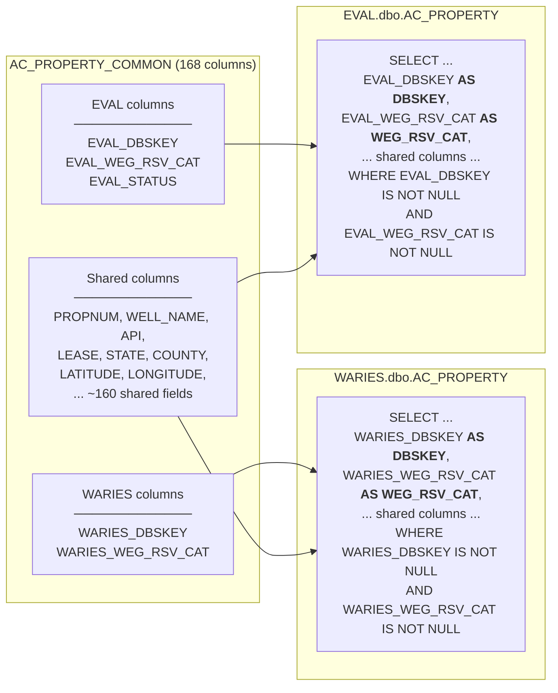
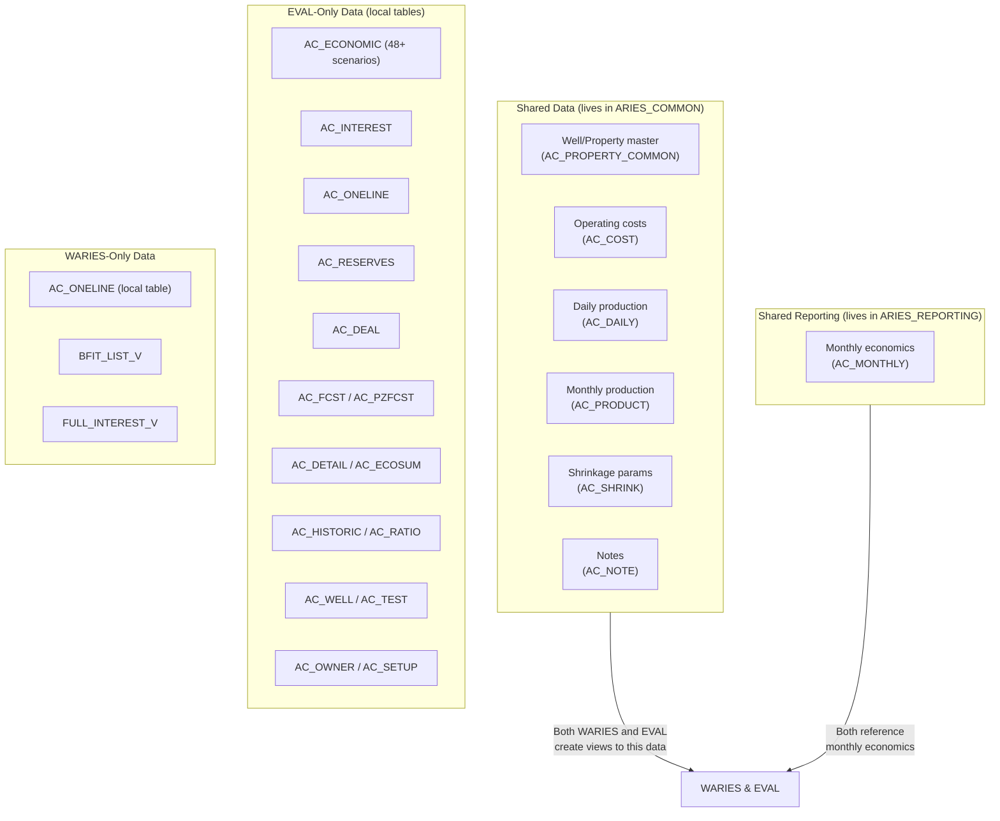
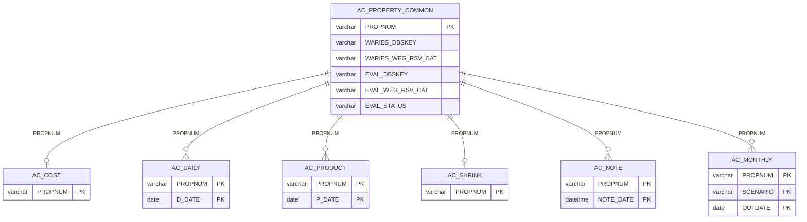
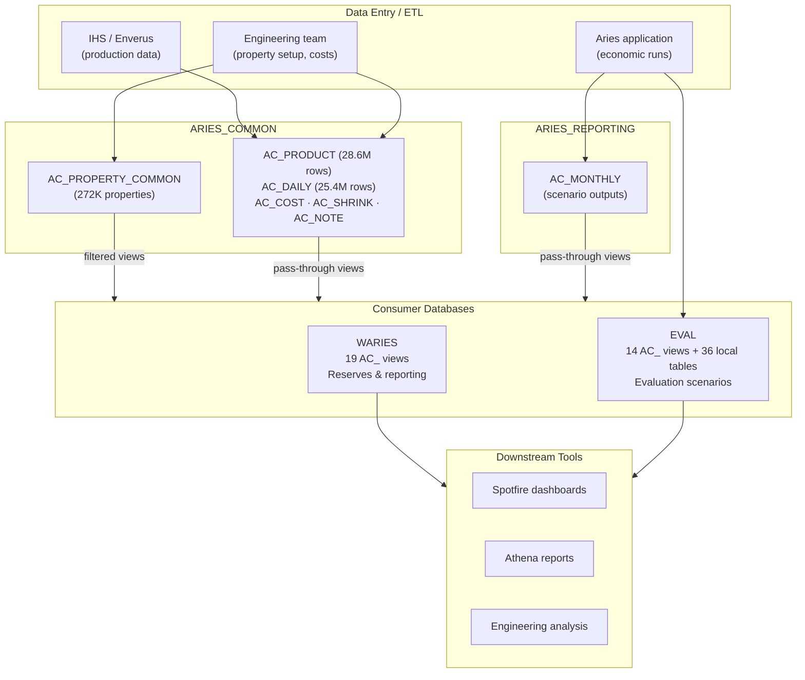

# Aries Database Ecosystem

> How WARIES, EVAL, and ARIES_COMMON share data on the **dbaries** SQL Server.

## The Big Picture

ARIES_COMMON is the **single source of truth** for well and property data. The
WARIES and EVAL databases don't store their own copies — they create **views**
that point back to ARIES_COMMON tables. Each database sees only the properties
assigned to it via filter columns in the common tables.

```mermaid
graph TB
    subgraph LEGEND[" "]
        direction LR
        L1[🟦 Base Table]
        L2[🟨 View]
        L3[🟩 Reporting Table]
    end

    subgraph AC["ARIES_COMMON — Master Database"]
        direction TB
        APC["🟦 AC_PROPERTY_COMMON<br/>───────────────────<br/>168 columns · 272,867 rows<br/><b>The master property table</b><br/>Contains WARIES_ and EVAL_<br/>prefixed columns for each DB"]
        ACC["🟦 AC_COST<br/>30 cols · 95K rows"]
        ACD["🟦 AC_DAILY<br/>13 cols · 25.4M rows"]
        ACPROD["🟦 AC_PRODUCT<br/>17 cols · 28.6M rows"]
        ACS["🟦 AC_SHRINK<br/>20 cols · 95K rows"]
        ACN["🟦 AC_NOTE<br/>4 cols · 130K rows"]
        APEPC["🟦 AC_PROPERTY_EVAL_PRE_COMMON<br/>106 cols · 72K rows"]
        APWPC["🟦 AC_PROPERTY_WARIES_PRE_COMMON<br/>89 cols · 12.7K rows"]
    end

    subgraph AR["ARIES_REPORTING"]
        ACM_SRC["🟩 AC_MONTHLY<br/>Monthly economic output"]
    end

    subgraph W["WARIES — Reserves & Economics"]
        direction TB
        W_PROP["🟨 AC_PROPERTY<br/><i>WARIES_DBSKEY → DBSKEY</i><br/><i>WARIES_WEG_RSV_CAT → WEG_RSV_CAT</i><br/>Filter: both NOT NULL"]
        W_COST["🟨 AC_COST"]
        W_DAILY["🟨 AC_DAILY"]
        W_PROD["🟨 AC_PRODUCT"]
        W_SHRINK["🟨 AC_SHRINK"]
        W_NOTE["🟨 AC_NOTE"]
        W_MONTHLY["🟨 AC_MONTHLY"]
        W_APEPC["🟨 AC_PROPERTY_EVAL_PRE_COMMON"]
        W_APWPC["🟨 AC_PROPERTY_WARIES_PRE_COMMON"]
        W_RPT["🟨 8 Reporting Views<br/><i>AC_DAILY_V, AC_MONTHLY_V,<br/>AC_ONELINE_V, AC_PROPERTY_SPOTFIRE_V,<br/>AC_PROD_NEW_WELLS_V, ACQ, etc.</i>"]
    end

    subgraph E["EVAL — Evaluation Scenarios"]
        direction TB
        E_PROP["🟨 AC_PROPERTY<br/><i>EVAL_DBSKEY → DBSKEY</i><br/><i>EVAL_WEG_RSV_CAT → WEG_RSV_CAT</i><br/>Filter: both NOT NULL"]
        E_DAILY["🟨 AC_DAILY"]
        E_PROD["🟨 AC_PRODUCT"]
        E_NOTE["🟨 AC_NOTE"]
        E_SHRINK["🟨 AC_SHRINK_OLD_10_21_19"]
        E_APEPC["🟨 AC_PROPERTY_EVAL_PRE_COMMON"]
        E_APWPC["🟨 AC_PROPERTY_WARIES_PRE_COMMON"]
        E_RPT["🟨 7 Reporting Views<br/><i>AC_MONTHLY_UNION_V,<br/>AC_ONELINE_UNION_V,<br/>AC_PROPERTY_UNION_V, etc.</i>"]
        E_LOCAL["🟦 36 Local AC_ Tables<br/><i>AC_ECONOMIC, AC_INTEREST,<br/>AC_ONELINE, AC_RESERVES,<br/>AC_FCST, AC_DEAL, etc.</i>"]
    end

    APC -->|"view"| W_PROP
    ACC -->|"view"| W_COST
    ACD -->|"view"| W_DAILY
    ACPROD -->|"view"| W_PROD
    ACS -->|"view"| W_SHRINK
    ACN -->|"view"| W_NOTE
    APEPC -->|"view"| W_APEPC
    APWPC -->|"view"| W_APWPC
    ACM_SRC -->|"view"| W_MONTHLY

    APC -->|"view"| E_PROP
    ACD -->|"view"| E_DAILY
    ACPROD -->|"view"| E_PROD
    ACN -->|"view"| E_NOTE
    ACS -->|"view"| E_SHRINK
    APEPC -->|"view"| E_APEPC
    APWPC -->|"view"| E_APWPC

    W_PROP --> W_RPT
    W_COST --> W_RPT
    W_SHRINK --> W_RPT
    W_MONTHLY --> W_RPT

    E_PROP --> E_RPT
    E_LOCAL --> E_RPT
```

---

## How Property Assignment Works

The key to the whole system is **AC_PROPERTY_COMMON** in ARIES_COMMON. It has
168 columns and contains **every property across all Aries databases**. Each
database gets its own set of filter/assignment columns:

**What this means in practice:**

- A property in WARIES has `WARIES_DBSKEY` and `WARIES_WEG_RSV_CAT` populated
- A property in EVAL has `EVAL_DBSKEY` and `EVAL_WEG_RSV_CAT` populated
- A property can exist in **both** databases (both sets of columns populated)
- Each database's view aliases away the prefix, so `DBSKEY` always means "my database's key"
- EVAL's AC_PROPERTY also exposes `WARIES_DBSKEY` and `WARIES_WEG_RSV_CAT` as-is (columns 121 and 134), allowing cross-database lookups

---

## Shared vs. Local Data

### Key difference between WARIES and EVAL

| Aspect | WARIES | EVAL |
|--------|--------|------|
| **Purpose** | Reserves & economics reporting | Evaluation scenarios |
| **AC_ views (from common)** | 9 pass-through views | 7 pass-through views |
| **AC_ reporting views** | 8 join views | 7 join/union views |
| **Local AC_ base tables** | Few (AC_ONELINE) | 36 tables (economics, forecasts, deals, interests, reserves) |
| **AC_PROPERTY filter** | `WARIES_DBSKEY IS NOT NULL` | `EVAL_DBSKEY IS NOT NULL` (inferred) |

EVAL has significantly more local tables because it stores detailed economic
run outputs (scenarios, forecasts, reserves) that don't need to be shared.

---

## The PROPNUM Key

Every table and view in the ecosystem joins on `PROPNUM` (varchar 12). This is
the universal well/property identifier across all Aries databases.

---

## Data Flow Summary

---

## Scale Reference

| Database | AC_ Tables | AC_ Views | Key Table | Rows |
|----------|-----------|-----------|-----------|------|
| **ARIES_COMMON** | 8 active + backups | 3 | AC_PROPERTY_COMMON | 272,867 |
| | | | AC_PRODUCT | 28,620,396 |
| | | | AC_DAILY | 25,449,014 |
| | | | AC_COST | 95,435 |
| | | | AC_SHRINK | 95,220 |
| | | | AC_NOTE | 129,815 |
| **ARIES_REPORTING** | 1 active | 0 | AC_MONTHLY | (scenario output) |
| **WARIES** | 0 (views only) | 19 | — | — |
| **EVAL** | 36 | 14 | AC_ECONOMIC, AC_INTEREST, etc. | (local scenarios) |

---

## Key Takeaways

1. **Don't edit ARIES_COMMON directly** — changes propagate to all databases instantly through views
2. **Property assignment** is controlled by populating `WARIES_DBSKEY`/`EVAL_DBSKEY` in AC_PROPERTY_COMMON
3. **Production and cost data is shared** — AC_DAILY, AC_PRODUCT, AC_COST, AC_SHRINK are the same data in both WARIES and EVAL
4. **Monthly economics come from ARIES_REPORTING** — Aries application writes scenario outputs there
5. **EVAL has local tables** for detailed economic modeling that WARIES doesn't need
6. **PROPNUM is the universal key** — every join in the ecosystem uses it
